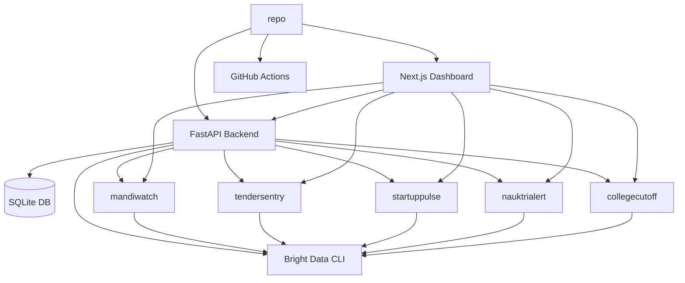

# BharatWatch Module Graph

```mermaid
graph TD
  REPO[repo] --> BACKEND[FastAPI Backend]
  REPO --> DASH[Next.js Dashboard]
  REPO --> CI[GitHub Actions]
  BACKEND --> DB[(SQLite DB)]
  BACKEND --> BD[Bright Data CLI]
  DASH --> BACKEND
  BACKEND --> MANDIWATCHModule[mandiwatch]
  MANDIWATCHModule --> BD
  DASH --> MANDIWATCHModule
  BACKEND --> TENDERSENTRYModule[tendersentry]
  TENDERSENTRYModule --> BD
  DASH --> TENDERSENTRYModule
  BACKEND --> STARTUPPULSEModule[startuppulse]
  STARTUPPULSEModule --> BD
  DASH --> STARTUPPULSEModule
  BACKEND --> NAUKTRIALERTModule[nauktrialert]
  NAUKTRIALERTModule --> BD
  DASH --> NAUKTRIALERTModule
  BACKEND --> COLLEGECUTOFFModule[collegecutoff]
  COLLEGECUTOFFModule --> BD
  DASH --> COLLEGECUTOFFModule
```
